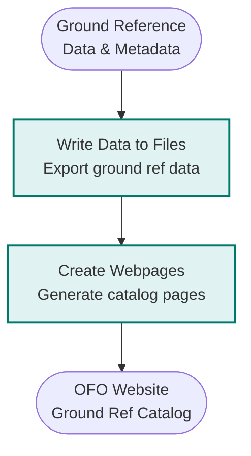

# OFO Catalog Data Prep

Code for constructing the Open Forest Observatory (OFO) drone & ground data catalog by ingesting raw data & metadata and processing it into derived products for publication.

## Overview

This repository contains the complete data processing pipeline for the Open Forest Observatory's drone imagery and ground reference data. The pipeline handles:

- **Raw data ingestion**: Extract EXIF metadata, standardize folder structures, reconcile contributed metadata
- **File preparation**: Copy, rename, fix EXIF tags, create thumbnails and ZIP archives
- **Photogrammetry**: Generate CHMs (Canopy Height Models), point clouds, and orthomosaics using Metashape
- **Individual Tree Detection (ITD)**: Detect and delineate individual trees from CHMs
- **Web catalog generation**: Create interactive web pages, maps, and datatables for data discovery

## Quick Start

### Prerequisites

- R with required packages (tidyverse, sf, terra, exifr, etc.)
- ExifTool for EXIF metadata operations
- Metashape for photogrammetry (via [automate-metashape](https://github.com/open-forest-observatory/automate-metashape))
- rclone configured with remote `js2s3` for object storage

### Running the Pipeline

All scripts depend on global constants defined in `00_set-constants.R`. Always source this first:

```r
source("deploy/drone-imagery-ingestion/00_set-constants.R")
```

Use controller scripts to run multi-step sequences:

```r
# Run metadata extraction pipeline (steps 01-07)
source("deploy/drone-imagery-ingestion/01_raw-imagery-metadata-prep/control_raw-imagery-metadata_01-to-07_perproject.R")

# Run file preparation for a single mission
source("deploy/drone-imagery-ingestion/02_raw-imagery-file-prep/08-13_prep-raw-imagery-files_per-mission.R")

# Run photogrammetry for a single mission
source("deploy/drone-imagery-ingestion/03_photogrammetry/15-22_photogrammetry_per-mission.R")
```

## Repository Structure

<details open>
<summary><strong>📁 Root Directory</strong></summary>

```
ofo-catalog-data-prep/
├── src/                          # Reusable function libraries
├── deploy/                       # Production pipeline scripts
├── .Rprofile                     # R project settings (styler config)
├── .lintr                        # Linting rules
├── _quarto.yml                   # Quarto project config
└── CLAUDE.md                     # AI assistant guidance
```

</details>

<details>
<summary><strong>📁 <a href="./src">src/</a></strong> - Reusable Function Libraries</summary>

```
src/
├── utils.R                                          # Common utilities (dir creation, UTM transforms, path handling)
├── metadata-extraction_imagery_general.R            # General image metadata extraction
├── metadata-extraction_imagery_dataset.R            # Dataset-level metadata extraction
├── metadata-extraction_imagery_perimage.R           # Per-image metadata extraction
├── photogrammetry-prep.R                            # Photogrammetry preparation utilities
├── web-catalog-creation_drone-imagery-catalog.R     # Drone catalog webpage generation
├── web-catalog-creation_ground-ref-data.R           # Ground reference catalog generation
└── web-catalog-creation_shared-functions.R          # Shared web catalog utilities
```

</details>

<details>
<summary><strong>📁 <a href="./deploy">deploy/</a></strong> - Production Pipeline Scripts</summary>

<details>
<summary><strong>📁 <a href="./deploy/drone-imagery-ingestion">deploy/drone-imagery-ingestion/</a></strong> - Main Drone Imagery Pipeline</summary>

```
deploy/drone-imagery-ingestion/
├── 00_set-constants.R                               # ⚙️ Global configuration (ALWAYS source this first!)
├── 01_raw-imagery-metadata-prep/                    # Steps 01-07: Metadata extraction
├── 02_raw-imagery-file-prep/                        # Steps 08-13: File operations
├── 03_photogrammetry/                               # Steps 15-22: Photogrammetry processing
├── 04_itd/                                          # Steps 30-31: Individual tree detection
├── 10_drone-mission-web-catalog/                    # Steps 05, 10: Web catalog generation
└── ARCHIVE/                                         # Deprecated scripts
```

<details>
<summary><strong>📁 01_raw-imagery-metadata-prep/</strong> - Metadata Extraction (Steps 01-07)</summary>

```
01_raw-imagery-metadata-prep/
├── control_raw-imagery-metadata_01-to-07_perproject.R   # 🎮 Controller: runs steps 01-07 sequentially
├── 01_read-folder-exif-to-csv.R                         # Extract raw EXIF from image folders
├── 02_plan-imagery-folder-standardization.R             # Plan folder structure standardization
├── 03_compile-baserow-metadata.R                        # Compile metadata from Baserow database
├── 04_determine-missions-to-process.R                   # Identify missions ready for processing
├── 05_parse-exif-metadata-per-image.R                   # Parse EXIF into structured format
├── 06_summarize-exif-metadata-per-mission.R             # Aggregate metadata per mission
├── 07_merge-exif-and-baserow.R                          # Merge EXIF + contributed metadata
├── combine-mission-metadata-files.R                     # Combine all mission metadata
├── combine-image-metadata-files.R                       # Combine all image metadata
└── one-offs/                                            # One-off analysis scripts
```

</details>

<details>
<summary><strong>📁 02_raw-imagery-file-prep/</strong> - File Preparation (Steps 08-13)</summary>

```
02_raw-imagery-file-prep/
├── 08-13_prep-raw-imagery-files_per-mission.R           # 🎮 Controller: runs steps 08-13 for one mission
├── 08-13_prep-raw-imagery-files_multi-mission.R         # 🎮 Controller: runs steps 08-13 for multiple missions
└── src/
    ├── 08_0pre_determine-missions-to-process.R          # Pre-step: determine mission list
    ├── 08_copy-images-to-standardized-folders.R         # Copy images to standardized structure
    ├── 09_fix-exif.R                                    # Fix/update EXIF metadata
    ├── 10_raw-imagery-thumbnails-and-zip.R              # Generate thumbnails and ZIP archives
    ├── 11_copy-raw-imagery-to-upload-staging-dir.R      # Stage files for upload
    ├── 12_upload-raw-imagery-to-object-store.R          # Upload to S3 via rclone
    └── 13_delete-prepped-raw-imagery.R                  # Clean up local files
```

</details>

<details>
<summary><strong>📁 03_photogrammetry/</strong> - Photogrammetry Pipeline (Steps 15-22)</summary>

```
03_photogrammetry/
├── 15-22_photogrammetry_per-mission.R                   # 🎮 Controller: runs steps 15-22 for one mission
├── 15-22_photogrammetry_multi-mission.R                 # 🎮 Controller: runs steps 15-22 for multiple missions
├── 16_determine-missions-to-process.R                   # Determine missions ready for photogrammetry
├── 20-21_photogrammetry_per-mission_one-off.R           # One-off processing script
└── src/
    ├── 17_download-unzip-images.R                       # Download imagery from S3
    ├── 18_prep-metashape-configs.R                      # Generate Metashape config files
    ├── 19_run-metashape.R                               # Execute Metashape processing
    ├── 19b_upload-metashape-products.R                  # Upload raw Metashape outputs
    ├── 20_postprocess-photogrammetry-products.R         # Post-process outputs (COG, thumbnails)
    └── 21_upload-postprocessed-photogrammetry.R         # Upload final products
```

</details>

<details>
<summary><strong>📁 04_itd/</strong> - Individual Tree Detection (Steps 30-31)</summary>

```
04_itd/
├── 30_determine-chms-for-itd.R                          # Identify CHMs ready for ITD
└── 31_detect-trees.R                                    # Run tree detection algorithm
```

</details>

<details>
<summary><strong>📁 10_drone-mission-web-catalog/</strong> - Web Catalog Generation</summary>

```
10_drone-mission-web-catalog/
├── 05_get-all-mission-metadata.R                        # Fetch metadata from S3
├── 10_create-drone-data-catalog-webpages.R              # Generate Hugo markdown pages
└── templates/
    └── drone-mission-details.md                         # Hugo page template
```

</details>

</details>

<details>
<summary><strong>📁 <a href="./deploy/drone-imagery-curation">deploy/drone-imagery-curation/</a></strong> - Data Curation Tools</summary>

```
deploy/drone-imagery-curation/
├── create-drone-imagery-curation-webpages.R             # Generate curation review pages
└── templates/
    └── drone-mission-curation-details.md                # Curation page template
```

</details>

<details>
<summary><strong>📁 <a href="./deploy/ground-ref-data">deploy/ground-ref-data/</a></strong> - Ground Reference Data Pipeline</summary>

```
deploy/ground-ref-data/
├── create-ground-ref-data-webpages.R                    # Generate ground ref catalog pages
├── write-ground-ref-data-to-files.R                     # Export ground ref data
└── templates/
    └── ground-ref-plot-details.md                       # Plot details page template
```

</details>

</details>

## Pipeline Workflow

### Drone Imagery Processing Pipeline

```mermaid
flowchart TD
    Start([Raw Imagery<br/>Contributions]) --> Step00[00: Set Constants<br/>Load global config]

    Step00 --> Meta01[01: Read EXIF<br/>Extract metadata from images]
    Meta01 --> Meta02[02: Plan Standardization<br/>Design folder structure]
    Meta02 --> Meta03[03: Compile Baserow<br/>Get contributed metadata]
    Meta03 --> Meta04[04: Determine Missions<br/>Identify processable missions]
    Meta04 --> Meta05[05: Parse EXIF<br/>Structure per-image metadata]
    Meta05 --> Meta06[06: Summarize Mission<br/>Aggregate mission-level data]
    Meta06 --> Meta07[07: Merge Data<br/>Combine EXIF + Baserow]

    Meta07 --> File08[08: Copy Images<br/>Standardize folder structure]
    File08 --> File09[09: Fix EXIF<br/>Update metadata tags]
    File09 --> File10[10: Thumbnails & ZIP<br/>Create archives]
    File10 --> File11[11: Stage Upload<br/>Prepare for transfer]
    File11 --> File12[12: Upload to S3<br/>via rclone]
    File12 --> File13[13: Delete Local<br/>Clean up files]

    File13 --> Photo17[17: Download & Unzip<br/>Fetch images from S3]
    Photo17 --> Photo18[18: Prep Metashape Config<br/>Generate processing params]
    Photo18 --> Photo19[19: Run Metashape<br/>Execute photogrammetry]
    Photo19 --> Photo19b[19b: Upload Raw Products<br/>CHM, point cloud, ortho]
    Photo19b --> Photo20[20: Post-process<br/>COG conversion, thumbnails]
    Photo20 --> Photo21[21: Upload Final Products<br/>Publish to S3]

    Photo21 --> ITD30[30: Determine CHMs<br/>Identify CHMs for ITD]
    ITD30 --> ITD31[31: Detect Trees<br/>Run tree detection]

    Meta07 --> WebCat05[05: Get Metadata<br/>Fetch from S3]
    ITD31 --> WebCat05
    Photo21 --> WebCat05
    WebCat05 --> WebCat10[10: Create Catalog<br/>Generate web pages]

    WebCat10 --> End([OFO Website<br/>Published Catalog])

    classDef metaClass fill:#e1f5ff,stroke:#0288d1,stroke-width:2px
    classDef fileClass fill:#fff3e0,stroke:#f57c00,stroke-width:2px
    classDef photoClass fill:#f3e5f5,stroke:#7b1fa2,stroke-width:2px
    classDef itdClass fill:#e8f5e9,stroke:#388e3c,stroke-width:2px
    classDef webClass fill:#fce4ec,stroke:#c2185b,stroke-width:2px
    classDef configClass fill:#fff9c4,stroke:#f9a825,stroke-width:3px

    class Meta01,Meta02,Meta03,Meta04,Meta05,Meta06,Meta07 metaClass
    class File08,File09,File10,File11,File12,File13 fileClass
    class Photo17,Photo18,Photo19,Photo19b,Photo20,Photo21 photoClass
    class ITD30,ITD31 itdClass
    class WebCat05,WebCat10 webClass
    class Step00 configClass
```



### Pipeline Stages Overview

| Stage | Steps | Purpose | Key Outputs |
|-------|-------|---------|-------------|
| **🔧 Configuration** | 00 | Load all global constants and paths | Environment setup |
| **📊 Metadata Extraction** | 01-07 | Extract and reconcile image metadata | Mission metadata, image metadata, sorting plans |
| **📁 File Preparation** | 08-13 | Organize, process, and upload raw imagery | Standardized folders, ZIPs, thumbnails → S3 |
| **🏔️ Photogrammetry** | 17-21 | Generate 3D products from imagery | CHMs, point clouds, orthomosaics → S3 |
| **🌲 Tree Detection** | 30-31 | Detect individual trees from CHMs | Tree locations, heights, crowns |
| **🌐 Web Catalog** | 05, 10 | Create public data discovery portal | Interactive maps, datatables, detail pages |

### Ground Reference Data Workflow



## Architecture

### Code Organization

This repository follows a clear separation between **reusable functions** and **production scripts**:

- **`/src`**: Function libraries that can be sourced by multiple scripts
  - Metadata extraction utilities
  - Photogrammetry helpers
  - Web catalog generation functions
  - Common utilities (coordinate transforms, path handling)

- **`/deploy`**: Production pipeline scripts organized by stage
  - Scripts are numbered sequentially (01, 02, 03...)
  - Controller scripts (`control_*.R`, `*_multi-mission.R`) orchestrate multi-step workflows
  - Each stage has `per-mission` (single) and `multi-mission` (batch) variants

### Data Flow

```
Raw Data (NFS: /ofo-share/catalog-data-prep/)
    ↓
Metadata Extraction & Validation
    ↓
File Standardization & Packaging
    ↓
Upload to Object Store (S3 via rclone)
    ↓
Photogrammetry Processing
    ↓
Post-processing & Upload
    ↓
Web Catalog Generation
    ↓
OFO Website Publication
```

### Key Configuration

All pipeline scripts depend on `deploy/drone-imagery-ingestion/00_set-constants.R`, which defines:

- **Data paths**: All input/output directories on NFS mounts
- **Processing parameters**: Image merge distances, thumbnail sizes, chunk counts
- **Remote storage**: rclone remote configuration, S3 paths
- **Website paths**: Hugo template locations, static file directories

**Important**: Always `source("deploy/drone-imagery-ingestion/00_set-constants.R")` at the start of any script.

## Mission Processing Lists

Missions to process are managed via text/CSV files in `/ofo-share/catalog-data-prep/00_missions-to-process/`:

- `01_raw-imagery-metadata-prep/`: Lists for metadata extraction
- `02_raw-imagery-file-prep/`: Lists for file preparation
- `03_photogrammetry/`: Lists for photogrammetry
- `04_itd/`: Lists for tree detection

## Data Storage Paths

All data is stored on NFS-mounted volumes under `/ofo-share/catalog-data-prep/`:

| Path | Purpose |
|------|---------|
| `01_raw-imagery-ingestion/` | Raw imagery, metadata, sorted images, ZIPs |
| `02_photogrammetry/` | Metashape configs, projects, outputs |
| `05_drone-imagery-web-catalog/` | Metadata pulled from S3 for catalog generation |
| `00_missions-to-process/` | Mission processing lists |

Object storage (S3) is accessed via rclone remote `js2s3`:
- Mission data: `/ofo-public/drone/missions_01/`
- Photogrammetry: `/ofo-internal/photogrammetry-outputs/`

## Development Notes

### Code Style

- Uses `styler` with tidyverse conventions
- **Assignment**: Uses `=` instead of `<-` (configured in `.Rprofile`)
- **Line length**: 100 characters max (`.lintr`)
- **Indentation**: Controlled by VS Code tabSize setting

### Running Scripts

Most scripts can be run in three ways:

1. **Single mission**: `*_per-mission.R` scripts (set `mission_id_foc` variable)
2. **Multiple missions**: `*_multi-mission.R` scripts (reads from mission list files)
3. **Controller scripts**: Run sequences of steps (e.g., `control_raw-imagery-metadata_01-to-07_perproject.R`)

### External Dependencies

- **ExifTool**: EXIF metadata reading/writing
- **Metashape**: Photogrammetry (via [automate-metashape](https://github.com/open-forest-observatory/automate-metashape) repo)
- **rclone**: Object storage sync (must configure remote `js2s3`)
- **untwine** (optional): COPC conversion (conda environment)

## License

See [LICENSE.md](LICENSE.md)

